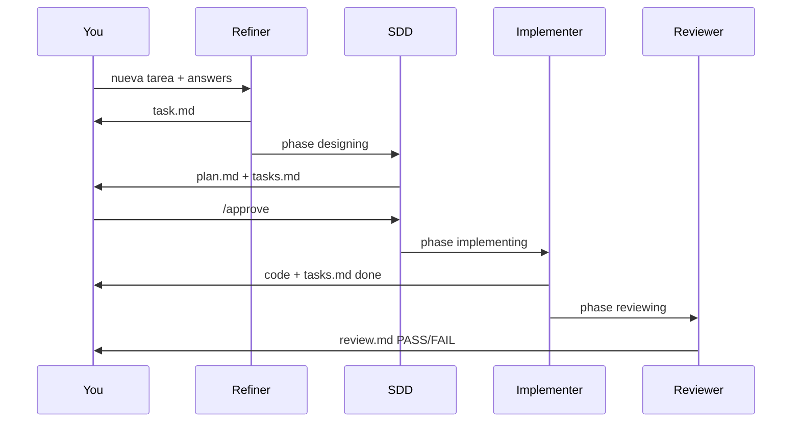

# Getting Started

[← Introduction](./introduction.md) · [Español](../es/getting-started.md)

---

## Prerequisites

| Requirement | Why |
|-------------|-----|
| **Node.js ≥ 18** | Runs the `specflow` CLI via `npx` |
| **Interactive terminal** | `init` uses a guided wizard (prompts) |
| **Git repo** (recommended) | Commit installed files; ignore per-task state |
| **Cursor** (recommended) | SpecFlow `init` installs the Cursor adapter; Linear MCP runs in Cursor |
| **Linear** (optional) | [Linear plugin in Cursor](./linear-integration.md) + `specflow linear setup` |

---

## Install

From your **project root**:

```bash
npx @ceatoleii/specflow init
```

No global install required — `npx` downloads the package and runs the wizard once.

### What the wizard asks

| Step | You choose | Why it matters |
|------|------------|----------------|
| Language | Español or English | CLI prompts only; agent rules stay English |
| Directory | Confirm project root | Where files are written |
| Cursor adapter | Install Cursor rules? (default: yes) | `.cursor/rules/_specflow.mdc` → orchestrator |
| Linear sync | Enable state mapping? | Writes `.specflow-linear.json` — [needs Cursor MCP](./linear-integration.md) |
| Project docs | Scaffold `.agents-docs/`? | Templates for architecture, conventions, verification |
| Summary | Confirm | Review before writing |

There is no `--yes` for `init` — the wizard is always interactive.

**Already installed?** Run `specflow linear setup` anytime to enable or change Linear mapping.

### Useful flags

```bash
specflow init --no-docs       # skip .agents-docs/ templates
specflow init --dry-run       # preview paths, no writes
specflow init -C ./my-app     # install into another directory
```

---

## What gets installed

| Path | Managed by | What to do with it |
|------|------------|-------------------|
| `AGENTS.md` | `init` / `sync` | Entry point — read once; do not hand-edit for product rules |
| `.agents/` | `init` / `sync` | Phase agents — **do not edit**; update via `sync` |
| `.specflow-version` | `init` / `sync` | Shows installed engine version |
| `.specflow-config.json` | `init` | Your `locale`, whether docs were scaffolded |
| `.specflow-tools.json` | `init` / `sync` | Which IDE adapters are installed |
| `.specflow-linear.json` | `init` / `linear setup` | Optional Linear state mapping |
| `.cursor/rules/_specflow.mdc` | `init` / `sync` | Cursor adapter (if selected) |
| `.agents-docs/` | **You** | Fill with *your* project facts |
| `.agents-state/` | Runtime | Per-task files — **gitignore** |

---

## Right after install

1. Add `.agents-state/` to `.gitignore`
2. Run **`specflow doctor`** — fix anything marked as error
3. Skim **[Project Layout](./project-layout.md)** so you know where artifacts appear
4. When ready, fill **[`.agents-docs/`](./project-documentation.md)** (at least `architecture.md` and `verification.md`)
5. If using Linear: follow **[Linear Integration](./linear-integration.md)** (plugin in Cursor → `specflow linear setup`)

### Verify install

```bash
specflow doctor
specflow doctor --run   # also runs commands from your verification.md
```

---

## Your first flow

This is the **minimum happy path** from zero to a reviewed task. Keep `.agents-state/current/` open in your editor — that is where truth lives during a task.

### 1. Start flow mode

In your AI chat (Cursor, Claude Code, etc.), say one of:

- `nueva tarea`
- `flow on`
- `new task`

**What happens:** SpecFlow creates `.agents-state/.flow-enabled` and sets phase to **refining**. The **Refiner** asks focused questions (not more than a few per round).

**What to look at:** nothing on disk yet except `phase.md` and `refinement-log.md`.

### 2. Refine the requirement

Answer the Refiner’s questions clearly — scope, “done” criteria, what must not break.

**What to look at:** `.agents-state/current/task.md`

| Section | Why read it |
|---------|-------------|
| **Acceptance Criteria** (`AC1`, `AC2`…) | This is the contract for review |
| **Constraints** | What must stay untouched |
| **Out of Scope** | What the agent will not build |

If something is wrong, say so in chat — the Refiner updates `task.md` before design starts.

### 3. Review the design

Phase moves to **designing**. The **SDD** agent writes:

| File | What it contains |
|------|------------------|
| `plan.md` | Approach, file changes, test scenarios |
| `tasks.md` | Ordered checklist (`[test]` before `[impl]`) |

**You do:** read both files. If the approach is wrong, ask for changes in chat. When satisfied:

```
/approve
```

(Also works: `aprobado`, `dale`.)

**Why `/approve` exists:** nothing in your codebase should change until you explicitly allow implementation.

### 4. Implementation

Phase **implementing**. Only the **Implementer** edits source files, following `tasks.md`.

**What to look at:**

- `tasks.md` — checkboxes `[ ]` → `[~]` → `[x]`
- Your git diff — should match the plan scope

If the agent stops with a “spec gap”, answer in chat or update the plan via SDD — do not guess.

### 5. Review and finish

Phase **reviewing**. The **Reviewer** checks every **AC** and runs commands from `.agents-docs/verification.md`.

**What to look at:** `.agents-state/current/review.md`

| Result | What happens |
|--------|----------------|
| **PASS** | Task copied to `.agents-state/history/YYYY-MM-DD-slug/`, flow deactivated |
| **FAIL** | Back to Implementer with concrete fixes listed |

### 6. Return to normal chat

Say `flow off` or `modo directo` anytime to leave flow mode without waiting for review.



---

## Working in a team

Everyone runs the same install in the repo:

```bash
npx @ceatoleii/specflow init   # once per clone, if not committed
npx @ceatoleii/specflow sync   # after someone bumps the engine version
```

| Commit to git | Do not commit |
|---------------|---------------|
| `AGENTS.md`, `.agents/`, `.agents-docs/`, adapters | `.agents-state/` (personal / per-task) |

`sync` updates the engine and adapters but **never** overwrites `.agents-docs/` — your project facts stay yours.

---

## Update SpecFlow

```bash
specflow status    # compare installed vs npm
specflow sync      # apply latest engine + adapters
```

See [Troubleshooting](./troubleshooting.md) if sync is blocked while a task is active.

---

[← Introduction](./introduction.md) · [How It Works →](./how-it-works.md)
