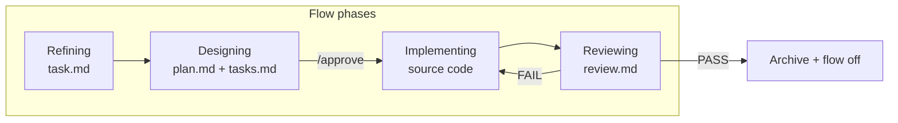

# How It Works

[← Getting Started](./getting-started.md) · [Español](../es/how-it-works.md)

---

## The pipeline

Every task follows the same story:

**Requirement → Plan → Tasks → Code → Review**



| Phase file | Agent | Writes code? | Main output |
|------------|-------|:------------:|-------------|
| `refining` | Refiner | No | `task.md` with **AC1**, **AC2**… |
| `designing` | SDD | No | `plan.md`, `tasks.md` |
| `implementing` | Implementer | **Yes** | Your codebase + `tasks.md` checkboxes |
| `reviewing` | Reviewer | No | `review.md` |

Older projects may still have `sdd.md` instead of `plan.md` — agents prefer `plan.md` when both exist.

---

## Direct mode vs Flow mode

| | Direct mode | Flow mode |
|---|-------------|-----------|
| **When** | Default | After `nueva tarea`, `flow on`, etc. |
| **Flag** | No `.agents-state/.flow-enabled` | File exists |
| **Behavior** | Normal assistant | Orchestrator picks phase agent |
| **Overhead** | None | Artifacts in `.agents-state/current/` |

**Why two modes:** small fixes should stay fast. Structured work opts in explicitly.

---

## What to inspect in each phase

Use this as a reading guide — open the file, check the section, decide if you need to intervene.

### Refining — read `task.md`

| Check | Good sign | Red flag |
|-------|-----------|----------|
| **AC*** | Specific, testable | Vague (“make it better”) |
| **Constraints** | Lists what must not break | Empty on risky changes |
| **Out of Scope** | Explicit exclusions | Missing on large tasks |

You do not need to edit the file yourself — reply in chat and the Refiner updates it.

### Designing — read `plan.md` and `tasks.md`

| Check | Good sign | Red flag |
|-------|-----------|----------|
| **plan.md** | Lists files and approach you agree with | Surprise refactors |
| **tasks.md** | Steps with Files / Verify / Done when | Vague tasks without verify command |
| Traceability | ACs mapped to scenarios | ACs with no plan |

Approve only when you would be comfortable seeing the diff described in the plan.

### Implementing — read `tasks.md` + git diff

| Check | Good sign | Red flag |
|-------|-----------|----------|
| Task order | `[test]` before `[impl]`; RED/GREEN in Task Notes | Skipped tests or missing RED evidence |
| Slices | `[review]` with PASS in Slice Reviews | Skipped slice review on large tasks |
| Scope | Matches task **Files** | Unrelated files changed |
| Blockers | Agent asks you | Silent assumptions |

### Reviewing — read `review.md`

| Check | Good sign | Red flag |
|-------|-----------|----------|
| Each **AC** | Row with evidence | Missing AC row |
| Verification | Gate complete + pasted output | Summary without real output |
| TDD | RED/GREEN per TXX in Task Notes | PASS without prior failing test |
| Decision | Clear PASS or FAIL | Ambiguous summary |

---

## Four agents in plain language

### Refiner

Turns your idea into a crisp `task.md`. Asks up to a few questions per round when input is vague; summarizes when you already wrote a detailed ticket. **Never** edits source code.

### SDD (Solution Design)

Produces the technical plan and task checklist from `task.md`. Presents summary in chat and waits. **Never** edits source code until you `/approve`.

### Implementer

**Only agent** that may change source files. Follows `tasks.md` exactly. Stops on spec gaps instead of guessing.

### Reviewer

Maps every **AC** to evidence, runs `.agents-docs/verification.md`, writes `review.md`. On **PASS**, archives the session and turns flow off.

---

## Activation phrases

| Start flow | End flow |
|------------|----------|
| `nueva tarea` · `activar flujo` · `flow on` · `new task` | `modo directo` · `flow off` · `desactivar flujo` · `direct mode` |
| `nueva tarea desde TEAM-123` · Linear issue URL | (same end phrases) |

The orchestrator reads `phase.md` on each message to decide which agent rules apply.

---

## Linear sync (optional)

When `.specflow-linear.json` has `"enabled": true` and you start from an issue id, the agent in **Cursor** uses Linear MCP to load the ticket and update board states.

| SpecFlow event | Default Linear state |
|----------------|----------------------|
| Refining complete | **Todo** |
| `/approve` | **In Progress** |
| Review PASS | **Done** |

Setup is **not** in the CLI API — see **[Linear Integration](./linear-integration.md)** for the Cursor plugin checklist.

---

## Files in `.agents-state/current/`

| File | Appears in phase | Purpose |
|------|------------------|---------|
| `phase.md` | Always | Current phase — routing source of truth |
| `refinement-log.md` | Refining | Q&A (compacted after `task.md`) |
| `task.md` | Refining+ | Requirement + **AC1**, **AC2**… |
| `plan.md` | Designing+ | Approved design (legacy: `sdd.md`) |
| `tasks.md` | Implementing+ | Checklist for Implementer |
| `review.md` | Reviewing | Result + verification output |
| `linear.json` | Linear tasks | Active issue identifier (optional) |

When flow is inactive, `current/` may be empty — that is normal.

---

## Approval gate

```
/approve
```

Also accepted: `aprobado`, `dale`.

**Why:** separates “I like the plan” from “start coding”. The Implementer must not run until approval is explicit.

---

## Verify your setup anytime

```bash
specflow doctor
specflow doctor --run
```

`doctor` checks installed files, adapters, and flow artifacts. `--run` executes the verification commands you documented for your project.

---

[← Getting Started](./getting-started.md) · [CLI Reference →](./cli-reference.md)
