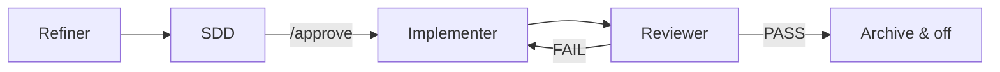

# How It Works

[← Getting Started](./getting-started.md) · [Español](../es/how-it-works.md)

---

## Pipeline

**Requirement → Plan → Tasks → Code**

| Step | Artifact | Agent |
|------|----------|-------|
| Requirement | `task.md` (AC1, AC2…) | Refiner |
| Plan | `plan.md` + `tasks.md` | SDD |
| Code | source files | Implementer |
| Verify | `review.md` | Reviewer |

Legacy projects may still have `sdd.md` instead of `plan.md` — agents read `plan.md` first.

---

## Two modes

| Mode | Trigger | Behavior |
|------|---------|----------|
| **Direct** | Default (no flag file) | Normal assistant behavior, zero overhead |
| **Flow** | `.agents-state/.flow-enabled` exists | Orchestrator routes to the active phase agent |

---

## Four agents, one pipeline



| Phase | Agent | Writes code? | Output |
|-------|--------|:------------:|--------|
| `refining` | Refiner | No | `task.md` with **AC1**, **AC2**… |
| `designing` | SDD | No | `plan.md` + `tasks.md` (requires `/approve`) |
| `implementing` | Implementer | **Yes** | Code + task checklist |
| `reviewing` | Reviewer | No | `review.md` + verification run |

### Refiner

Clarifies the requirement. Adapts questioning to how much detail the user provided (vague idea vs full PRD). Produces `task.md` with numbered acceptance criteria. Never writes code.

### SDD

Designs from `task.md`. Writes `plan.md` (technical design + scenario traceability) and `tasks.md` (TDD-ordered checklist). Waits for explicit **`/approve`** before code.

### Implementer

The **only** agent allowed to edit source files. Executes `tasks.md` in order (`[test]` before `[impl]`). Stops on spec gaps or blockers.

### Reviewer

Verifies every **AC** from `task.md` with evidence, runs `verification.md` commands, writes `review.md`. On PASS, archives to `.agents-state/history/YYYY-MM-DD-slug/` and deactivates flow.

---

## Activation phrases

| Start flow | End flow |
|------------|----------|
| `nueva tarea` · `activar flujo` · `flow on` · `new task` | `modo directo` · `flow off` · `desactivar flujo` · `direct mode` |

---

## State on disk

During an active task, artifacts live in `.agents-state/current/`:

| File | Phase | Purpose |
|------|-------|---------|
| `phase.md` | all | Current phase — source of truth |
| `task.md` | refining+ | Requirement + **AC1**, **AC2**… |
| `plan.md` | designing+ | Technical plan (legacy: `sdd.md`) |
| `tasks.md` | implementing+ | Ordered checklist |
| `review.md` | reviewing | Review result |
| `refinement-log.md` | refining | Q&A (compacted after task.md) |

---

## Approval gate

No implementation until you approve the design: `/approve` (also `aprobado`, `dale`).

---

## Verify setup

```bash
specflow doctor
specflow doctor --run   # also runs verification.md commands
```

---

[← Getting Started](./getting-started.md) · [CLI Reference →](./cli-reference.md)
