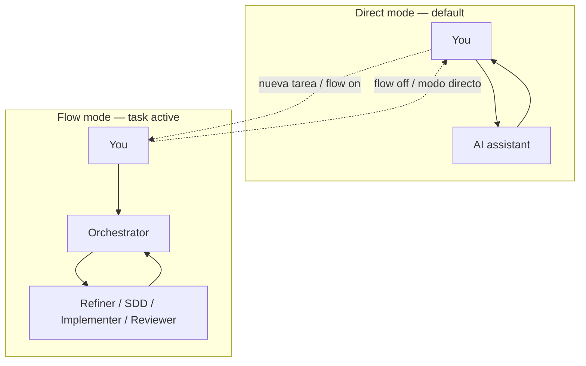

# Introduction

[← Guide home](./README.md) · [Español](../es/introduction.md)

---

## The problem

AI assistants are fast, but unstructured chats often lead to:

- Vague requirements going straight into code
- Scope creep and unreviewed changes
- Lost context between “let’s plan this” and “here’s the patch”

You end up re-explaining the same constraints in every session.

---

## What SpecFlow does

SpecFlow is a small CLI (`@ceatoleii/specflow`) that installs a **structured workflow** into your repository. Your assistant still feels like chat — but behind the scenes it follows phases, writes specs to disk, and only one agent is allowed to touch source code.

**Pipeline:** Requirement → Plan → Tasks → Code

**Cursor** is the supported IDE in v2.2+ (`init` installs its adapter). Optional **[Linear](./linear-integration.md)** sync uses the Linear MCP plugin inside Cursor — not API keys in the CLI.

| Phase | Who | Your involvement |
|-------|-----|------------------|
| Refine | Refiner | Answer questions; approve `task.md` implicitly by moving on |
| Design | SDD | Read `plan.md` / `tasks.md`; say **`/approve`** to allow code |
| Implement | Implementer | Watch progress; unblock if asked |
| Review | Reviewer | Read `review.md`; PASS archives and ends flow |

---

## Why use it

| Benefit | How |
|---------|-----|
| **Clarity before code** | Acceptance criteria (**AC1**, **AC2**…) live in `task.md` before any edit |
| **Design gate** | No implementation until you `/approve` the plan |
| **Single writer** | Only Implementer edits source files — less accidental refactors |
| **Auditable trail** | Artifacts in `.agents-state/current/`; completed tasks in `history/` |
| **Team alignment** | Same rules in `.agents/` for everyone; `sync` updates the engine |

---

## When to use it — and when not to

| Use SpecFlow | Skip it |
|--------------|---------|
| Feature has real scope and acceptance criteria | One-line typo fix |
| You want a plan you can read before code lands | You already have a signed-off spec elsewhere |
| Several people/tools should follow the same rules | You prefer fully ad-hoc chat every time |

**Direct mode** (default): no `.agents-state/.flow-enabled` → zero overhead, normal assistant.

**Flow mode**: you start a task → orchestrator routes to the active phase agent.

---

## How it fits your project

SpecFlow adds **configuration and runtime folders** — not a new app framework.

| Area | Who maintains it | Purpose |
|------|------------------|---------|
| Your source code | You (Implementer during flow) | The product you ship |
| `.agents-docs/` | **You** | Facts about *your* stack, style, tests |
| `.agents/` | SpecFlow (`init` / `sync`) | Phase agents & templates |
| `.agents-state/` | Runtime (gitignored) | Active task files |

Project knowledge goes in **`.agents-docs/`** so agents stop guessing. Engine rules live in **`.agents/`** and update safely with **`specflow sync`**.

---

## What you will not find here

This guide explains **how to use** SpecFlow in your project — not how the npm package is built internally. For day-to-day work you do not need to read maintainer docs or CLI source code.

---

[← Guide home](./README.md) · [Getting Started →](./getting-started.md)
