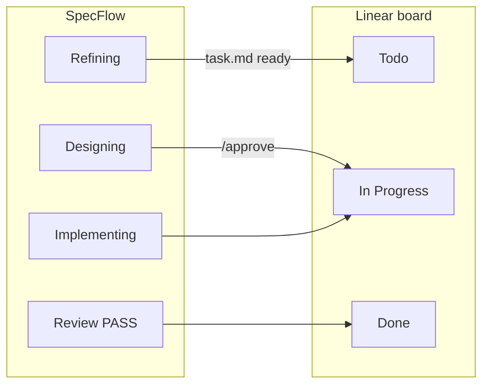

# Linear Integration

[← IDE Adapters](./ide-adapters.md) · [Español](../es/linear-integration.md)

---

## What this is (and what it is not)

**SpecFlow does not connect to Linear from the CLI.** There is no API key in `specflow init` or `specflow linear setup`.

| Layer | Role |
|-------|------|
| **Cursor + Linear plugin** | Authenticates you with Linear and exposes MCP tools (`get_issue`, `save_issue`) |
| **SpecFlow in your repo** | Rules + `.specflow-linear.json` tell the **agent in Cursor** when to call those tools |
| **Your chat** | You start flow with `nueva tarea desde TEAM-123` or a Linear URL |

If MCP is unavailable, the SpecFlow pipeline still runs locally — only board updates are skipped.

---

## Prerequisites checklist

Complete these **in Cursor** (once per machine), then configure the **project**:

### 1. Install Linear in Cursor

1. Open **Cursor Settings** → **Plugins** (or Extensions).
2. Find **Linear** and install/enable it.
3. Sign in to your Linear workspace when prompted.

### 2. Confirm MCP is available

1. In Cursor, open **MCP** / integrations settings.
2. Verify the **linear** server is listed and connected (green/active).
3. You should have tools such as `get_issue` and `save_issue` available to the agent.

> SpecFlow cannot verify MCP from the terminal today. If sync fails, fix Cursor ↔ Linear first.

### 3. Configure the project

```bash
npx @ceatoleii/specflow init          # answer “yes” to Linear when asked
# or, for an existing install:
specflow linear setup
specflow linear setup --enable        # defaults only, no prompts
specflow status                       # should show Linear: enabled
```

This writes `.specflow-linear.json`:

```json
{
  "enabled": true,
  "states": {
    "onRefiningComplete": "Todo",
    "onApprove": "In Progress",
    "onReviewPass": "Done",
    "onReviewFail": "In Progress"
  }
}
```

Rename states if your Linear team uses different labels (`specflow linear setup` lets you customize).

---

## How spec phases map to Linear



| SpecFlow moment | Default Linear state |
|-----------------|----------------------|
| Refining finished, waiting for `/approve` | **Todo** |
| User `/approve` → implementing | **In Progress** |
| Review **PASS** | **Done** |
| Review **FAIL** | Stays **In Progress** |

There is no separate “Review” column in most Linear teams — the reviewing phase does not move the card until PASS → **Done**.

---

## Start a task from a Linear issue

In **Cursor chat** (with flow enabled in the project):

```text
nueva tarea desde ENG-42
```

or paste:

```text
https://linear.app/your-team/issue/ENG-42/some-title
```

**What the agent should do:**

1. Call MCP `get_issue` for `ENG-42`
2. Write `.agents-state/current/linear.json` with the identifier
3. Build `task.md` from the issue title and description
4. Run the normal Refiner → SDD → Implementer → Reviewer pipeline
5. Update Linear state at each handoff (see table above)

Manual tasks still work: `nueva tarea` without an issue id.

---

## Files involved

| File | Purpose |
|------|---------|
| `.specflow-linear.json` | `enabled` + state name mapping (project config) |
| `.agents-state/current/linear.json` | Active issue id for this task |
| `.agents/rules/linear.md` | Agent instructions for MCP (managed by `sync`) |

---

## Disable or reconfigure

```bash
specflow linear setup --disable
```

Or edit `.specflow-linear.json` manually (`sync` will not overwrite it).

---

## Troubleshooting

| Symptom | Likely cause | Fix |
|---------|--------------|-----|
| Agent never updates Linear | MCP not connected in Cursor | Plugin login + MCP settings |
| “Linear MCP unavailable” | Plugin disabled or wrong workspace | Re-auth in Cursor |
| Wrong state name error | Team uses custom status names | `specflow linear setup` → set exact names |
| Flow works, board empty | Linear disabled in config | `specflow linear setup --enable` |
| `specflow linear setup` fails NO_TTY | Run in a real terminal | Not CI/non-interactive shell |

More: [Troubleshooting](./troubleshooting.md#linear-mcp).

---

[← IDE Adapters](./ide-adapters.md) · [CLI Reference →](./cli-reference.md)
