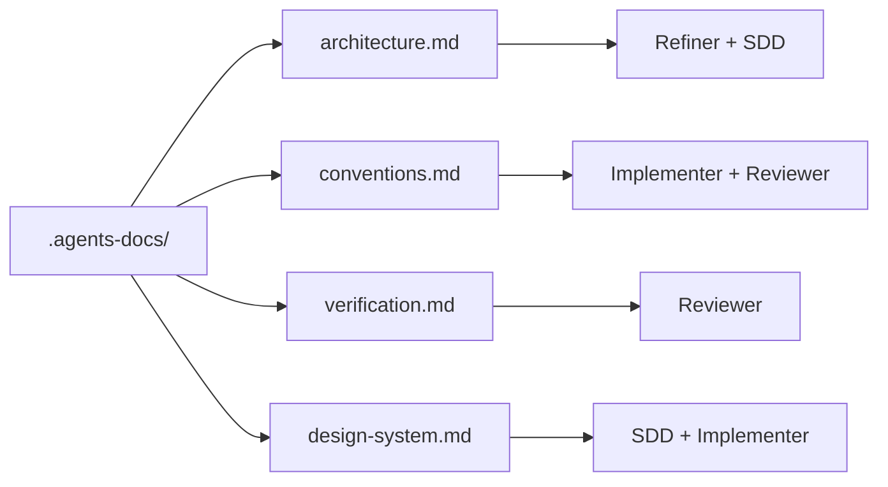

# Project Documentation

[← Project Layout](./project-layout.md) · [Español](../es/project-documentation.md)

---

## Why `.agents-docs/` exists

SpecFlow ships **generic** workflow rules in `.agents/`. Your repo is unique — stack, folders, test commands, UI tokens.

**`.agents-docs/`** is where you teach agents *your* project so they:

- Ask fewer redundant questions during refinement
- Design plans that match your architecture
- Implement and review using **your** real verification commands

SpecFlow works without it, but quality drops. Templates are created at `init` unless you pass `--no-docs`.

---

## Files and who reads them

| File | Read during | Answer this question |
|------|-------------|----------------------|
| `architecture.md` | Refine, Design | What is this project and how is it organized? |
| `conventions.md` | Implement, Review | How should code look here? |
| `verification.md` | Review | How do we prove a change is correct? |
| `design-system.md` | Design, Implement | How should UI look? (optional) |



---

## What to write in each file

### `architecture.md`

Include:

- Project type (web app, API, CLI, mobile, …)
- Language, framework, runtime
- Folder structure agents should respect
- Rules (“auth lives in `src/auth/`”, “no direct DB from UI”)
- External services (APIs, databases) at a **usage** level — not internal ops secrets

### `conventions.md`

Include:

- Naming (files, functions, components)
- Patterns you prefer (and anti-patterns to avoid)
- Import style, error handling expectations
- Commit or PR conventions if relevant

### `verification.md`

Include commands **in run order**:

```bash
npm ci
npm run lint
npm test
npm run build
```

For each: expected exit code and what “pass” means (e.g. coverage threshold).

The **Reviewer** runs these during the reviewing phase. Stale commands → false FAIL reviews.

### `design-system.md` (optional)

Tokens, components, spacing, a11y rules. **Delete the file** if the project has no UI.

---

## When to fill it in

| Timing | Recommendation |
|--------|----------------|
| Right after `init` | Keep templates; skim structure |
| Before first real flow task | Minimum: `architecture.md` + `verification.md` |
| UI projects | Complete or add `design-system.md` |
| After major stack change | Update docs in the same PR |

---

## What `sync` never touches

```bash
specflow sync
```

Your `.agents-docs/` survives engine upgrades. If upstream templates improve, compare manually and merge ideas — SpecFlow will not overwrite your prose.

---

## Tips for useful docs

1. **Be specific** — “Use TanStack Query for server state” beats “follow best practices”
2. **Use real paths** — `src/features/auth/` not “the auth module”
3. **Keep verification current** — broken commands block releases at review time
4. **Delete noise** — remove `design-system.md` in backend-only repos
5. **No secrets** — use env var *names* and doc links, not API keys or passwords

---

## Team note

Commit `.agents-docs/` like any other team convention. When someone improves `verification.md`, everyone gets better reviews on the next task.

---

[← Project Layout](./project-layout.md) · [IDE Adapters →](./ide-adapters.md)
