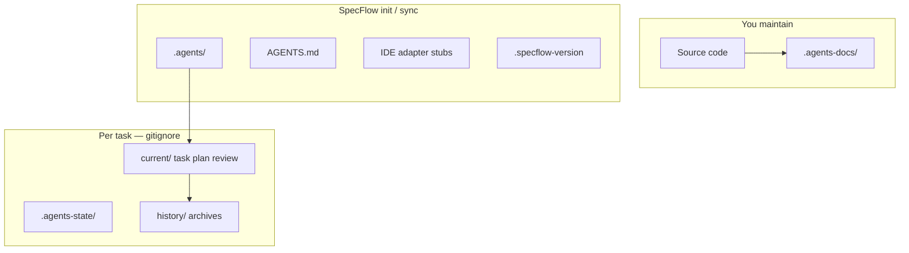

# Project Layout

[← CLI Reference](./cli-reference.md) · [Español](../es/project-layout.md)

---

After `specflow init`, your repository gains SpecFlow folders alongside your existing code. Think of it as **three layers**: engine (managed), your docs (manual), runtime (gitignored).



---

## Typical tree

```
your-project/
├── AGENTS.md                 # Universal entry ([agents.md](https://agents.md/))
├── .specflow-version         # Installed engine version
├── .specflow-config.json     # locale, includeDocs from init
├── .specflow-tools.json      # Installed IDE adapters
│
├── .agents/                  # Engine — orchestrator + 4 phase agents
│   ├── rules/
│   └── templates/
│
├── .agents-docs/             # YOUR project knowledge
│   ├── architecture.md
│   ├── conventions.md
│   ├── verification.md
│   └── design-system.md      # optional — delete if N/A
│
├── .agents-state/            # Runtime — add to .gitignore
│   ├── .flow-enabled         # Present while flow is active
│   ├── current/
│   │   ├── phase.md
│   │   ├── task.md
│   │   ├── plan.md
│   │   ├── tasks.md
│   │   └── review.md
│   └── history/              # Completed tasks (YYYY-MM-DD-slug/)
│
└── .cursor/                  # Example if Cursor adapter selected
    └── rules/_specflow.mdc
```

Other adapters add their own paths — see [IDE Adapters](./ide-adapters.md).

---

## What to open when

| You want to… | Open |
|--------------|------|
| See which phase is active | `.agents-state/current/phase.md` |
| Read the requirement contract | `task.md` |
| Review design before code | `plan.md`, `tasks.md` |
| Watch implementation progress | `tasks.md` + git diff |
| See review outcome | `review.md` |
| Teach agents your stack | `.agents-docs/architecture.md` |
| Teach agents how to test | `.agents-docs/verification.md` |

---

## Managed vs owned

### SpecFlow manages (`init` / `sync`)

| Path | Updates on `sync`? |
|------|:------------------:|
| `AGENTS.md` | Yes |
| `.agents/**` | Yes |
| `.specflow-version` | Yes |
| `.specflow-tools.json` | Yes |
| Adapter stub files | Yes (installed adapters only) |

**Do not hand-edit** `.agents/rules/` to change product behavior — run `sync` after upgrading the package.

### You own

| Path | Notes |
|------|-------|
| `.agents-docs/**` | Never overwritten by `sync` |
| Source code | Only Implementer during flow |
| `.gitignore` | Must include `.agents-state/` |

### Runtime only

| Path | Notes |
|------|-------|
| `.agents-state/**` | Safe to delete when no active task |
| `.agents-state/current/*` | Cleared on PASS archive |

---

## Recommended `.gitignore`

```gitignore
.agents-state/
```

Commit SpecFlow engine files and `.agents-docs/` so the team shares the same rules and project context.

---

## Team workflow

| Action | Who | Command / habit |
|--------|-----|-----------------|
| First clone | Each dev | `init` if files not committed, or pull |
| Engine upgrade | Whoever bumps version | `sync` + commit `.specflow-version` |
| Active task | Individual | Keep `.agents-state/` local only |
| Project facts | Team | PRs to `.agents-docs/` |

---

[← CLI Reference](./cli-reference.md) · [Project Documentation →](./project-documentation.md)
