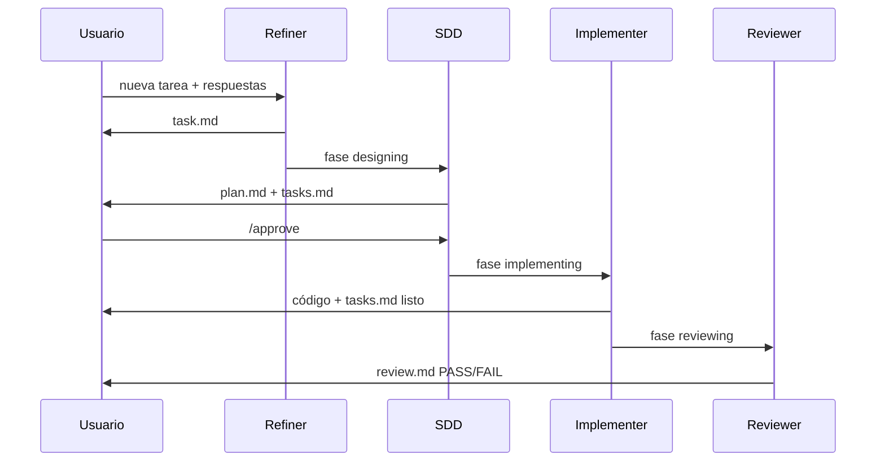

# Primeros pasos

[← Introducción](./introduction.md) · [English](../en/getting-started.md)

---

## Requisitos

| Requisito | Por qué |
|-----------|---------|
| **Node.js ≥ 18** | Ejecuta el CLI con `npx` |
| **Terminal interactiva** | `init` usa un asistente con prompts |
| **Repo git** (recomendado) | Commitear instalación; ignorar estado por tarea |

---

## Instalación

Desde la **raíz del proyecto**:

```bash
npx @ceatoleii/specflow init
```

No hace falta instalación global — `npx` descarga el paquete y lanza el asistente.

### Qué pregunta el asistente

| Paso | Eliges | Para qué |
|------|--------|----------|
| Idioma | Español o English | Solo prompts del CLI |
| Directorio | Confirmar raíz | Dónde se escriben archivos |
| Herramientas IA | Cursor, Claude Code, Copilot… | Stubs por IDE |
| Docs del proyecto | ¿Plantillas `.agents-docs/`? | architecture, conventions, verification |
| Resumen | Confirmar | Revisar antes de escribir |

No hay `--yes` en `init` — el asistente es siempre interactivo.

### Opciones útiles

```bash
specflow init --no-docs       # sin plantillas .agents-docs/
specflow init --dry-run       # vista previa, sin escribir
specflow init -C ./my-app     # otro directorio destino
```

---

## Qué se instala

| Ruta | Gestionado por | Qué hacer |
|------|----------------|-----------|
| `AGENTS.md` | `init` / `sync` | Entrada universal — leer una vez |
| `.agents/` | `init` / `sync` | Agentes de fase — **no editar** |
| `.specflow-version` | `init` / `sync` | Versión del motor instalada |
| `.specflow-config.json` | `init` | `locale`, si hubo scaffold de docs |
| `.specflow-tools.json` | `init` / `sync` | Adaptadores instalados |
| Archivos adapter | por herramienta | ej. `.cursor/rules/_specflow.mdc` |
| `.agents-docs/` | **Tú** | Hechos de tu proyecto |
| `.agents-state/` | Runtime | Por tarea — **gitignore** |

---

## Justo después de instalar

1. Añade `.agents-state/` al `.gitignore`
2. Ejecuta **`specflow doctor`**
3. Lee **[Layout del proyecto](./project-layout.md)**
4. Completa **[`.agents-docs/`](./project-documentation.md)** cuando vayas en serio (mínimo `architecture.md` y `verification.md`)

### Verificar

```bash
specflow doctor
specflow doctor --run
```

---

## Tu primer flujo

Recorrido **mínimo** de cero a tarea revisada. Mantén abierto `.agents-state/current/` — ahí está la verdad durante la tarea.

### 1. Activar modo flujo

En tu chat de IA:

- `nueva tarea`
- `flow on`
- `activar flujo`

**Qué pasa:** se crea `.agents-state/.flow-enabled` y fase **refining**. El **Refiner** hace preguntas concretas.

**Qué mirar:** `phase.md` y `refinement-log.md`.

### 2. Refinar el requisito

Responde con alcance, qué es “hecho” y qué no debe romperse.

**Qué mirar:** `.agents-state/current/task.md`

| Sección | Por qué leerla |
|---------|----------------|
| **Criterios de aceptación** (AC1, AC2…) | Contrato de la revisión |
| **Constraints** | Lo que no debe cambiar |
| **Out of Scope** | Lo que no se construirá |

Si algo falla, dilo en el chat — el Refiner actualiza `task.md`.

### 3. Revisar el diseño

Fase **designing**. El **SDD** escribe:

| Archivo | Contenido |
|---------|-----------|
| `plan.md` | Enfoque, archivos, escenarios |
| `tasks.md` | Lista ordenada (`[test]` antes de `[impl]`) |

**Tú:** lees ambos. Si algo no cuadra, pide cambios. Cuando estés de acuerdo:

```
/approve
```

(también: `aprobado`, `dale`).

**Por qué `/approve`:** el código no debe cambiar hasta que lo autorices.

### 4. Implementación

Fase **implementing**. Solo **Implementer** edita código según `tasks.md`.

**Qué mirar:**

- `tasks.md` — casillas `[ ]` → `[~]` → `[x]`
- diff de git — debe coincidir con el plan

Si hay “hueco en la spec”, responde en chat — no adivines.

### 5. Revisión y cierre

Fase **reviewing**. **Reviewer** valida cada **AC** y corre `.agents-docs/verification.md`.

**Qué mirar:** `review.md`

| Resultado | Qué pasa |
|-----------|----------|
| **PASS** | Copia a `history/YYYY-MM-DD-slug/`, flujo desactivado |
| **FAIL** | Vuelve a Implementer con lista concreta |

### 6. Volver al chat normal

`flow off` o `modo directo` en cualquier momento.



---

## Trabajo en equipo

Todos usan la misma instalación en el repo:

```bash
npx @ceatoleii/specflow init
npx @ceatoleii/specflow sync
```

| Commitear | No commitear |
|-----------|--------------|
| `AGENTS.md`, `.agents/`, `.agents-docs/`, adapters | `.agents-state/` |

`sync` actualiza motor y adaptadores pero **nunca** pisa `.agents-docs/`.

---

## Actualizar SpecFlow

```bash
specflow status
specflow sync
```

Ver [Solución de problemas](./troubleshooting.md) si `sync` se bloquea con tarea activa.

---

[← Introducción](./introduction.md) · [Cómo funciona →](./how-it-works.md)
