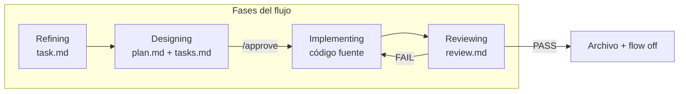

# Cómo funciona

[← Primeros pasos](./getting-started.md) · [English](../en/how-it-works.md)

---

## El pipeline

Cada tarea sigue la misma historia:

**Requisito → Plan → Tareas → Código → Revisión**



| Fase en `phase.md` | Agente | ¿Escribe código? | Salida principal |
|--------------------|--------|:----------------:|------------------|
| `refining` | Refiner | No | `task.md` con **AC1**, **AC2**… |
| `designing` | SDD | No | `plan.md`, `tasks.md` |
| `implementing` | Implementer | **Sí** | Código + casillas en `tasks.md` |
| `reviewing` | Reviewer | No | `review.md` |

Proyectos antiguos pueden tener `sdd.md` en lugar de `plan.md` — se prefiere `plan.md`.

---

## Modo directo vs modo flujo

| | Modo directo | Modo flujo |
|---|--------------|------------|
| **Cuándo** | Por defecto | Tras `nueva tarea`, `flow on`, etc. |
| **Señal** | Sin `.flow-enabled` | Archivo presente |
| **Comportamiento** | Asistente normal | Orquestador elige agente |
| **Overhead** | Ninguno | Artefactos en `current/` |

**Por qué dos modos:** los arreglos pequeños deben seguir siendo rápidos. El trabajo estructurado se elige a propósito.

---

## Qué revisar en cada fase

Guía de lectura — abre el archivo, mira la sección, decide si intervenir.

### Refining — lee `task.md`

| Revisa | Buena señal | Alerta |
|--------|-------------|--------|
| **AC*** | Concretos y verificables | Vagos (“mejóralo”) |
| **Constraints** | Lista lo que no debe romperse | Vacío en cambios arriesgados |
| **Out of Scope** | Exclusiones claras | Falta en tareas grandes |

No hace falta editar el archivo — responde en el chat.

### Designing — lee `plan.md` y `tasks.md`

| Revisa | Buena señal | Alerta |
|--------|-------------|--------|
| **plan.md** | Archivos y enfoque acordados | Refactors sorpresa |
| **tasks.md** | Pasos con Files / Verify / Done when | Tareas vagas sin comando de verificación |
| Trazabilidad | ACs ligados a escenarios | ACs sin plan |

Aprueba solo si el diff descrito te parece aceptable.

### Implementing — `tasks.md` + diff git

| Revisa | Buena señal | Alerta |
|--------|-------------|--------|
| Orden | `[test]` antes de `[impl]`; RED/GREEN en Task Notes | Tests saltados o sin evidencia RED |
| Slices | `[review]` con PASS en Slice Reviews | Saltar review intermedia en tareas grandes |
| Alcance | Coincide con **Files** del task | Archivos ajenos |
| Bloqueos | Pregunta a ti | Suposiciones silenciosas |

### Reviewing — lee `review.md`

| Revisa | Buena señal | Alerta |
|--------|-------------|--------|
| Cada **AC** | Fila con evidencia | AC sin fila |
| Verificación | Gate completo + salida pegada | Resumen sin output real |
| TDD | RED/GREEN por TXX en Task Notes | PASS sin evidencia de fallo previo |
| Decisión | PASS o FAIL claro | Resumen ambiguo |

---

## Cuatro agentes en lenguaje claro

### Refiner

Convierte la idea en `task.md` claro. Pocas preguntas por ronda si el input es vago; resume si ya trajiste un ticket largo. **Nunca** edita código fuente.

### SDD

Plan técnico y checklist desde `task.md`. Espera **`/approve`**. **Nunca** edita código hasta entonces.

### Implementer

**Único agente** que puede cambiar código. Sigue `tasks.md`. Para ante huecos de spec.

### Reviewer

Evidencia por **AC**, ejecuta `verification.md`, escribe `review.md`. En **PASS**, archiva y apaga el flujo.

---

## Frases de activación

| Iniciar flujo | Terminar flujo |
|---------------|----------------|
| `nueva tarea` · `activar flujo` · `flow on` | `modo directo` · `flow off` · `desactivar flujo` |
| `nueva tarea desde TEAM-123` · URL del issue | (mismas frases de cierre) |

El orquestador lee `phase.md` en cada mensaje.

---

## Sync con Linear (opcional)

Con `.specflow-linear.json` `"enabled": true`, el agente en **Cursor** usa MCP para cargar el ticket y actualizar estados.

| Evento SpecFlow | Estado Linear por defecto |
|-----------------|---------------------------|
| Refining terminado | **Todo** |
| `/approve` | **In Progress** |
| Review PASS | **Done** |

La conexión real es Cursor ↔ Linear — ver **[Integración Linear](./linear-integration.md)**.

---

## Archivos en `.agents-state/current/`

| Archivo | Fase | Propósito |
|---------|------|-----------|
| `phase.md` | Siempre | Fase actual |
| `refinement-log.md` | Refining | Preguntas y respuestas |
| `task.md` | Refining+ | Requisito + ACs |
| `plan.md` | Designing+ | Diseño (legacy: `sdd.md`) |
| `tasks.md` | Implementing+ | Checklist |
| `review.md` | Reviewing | Resultado |
| `linear.json` | Tareas Linear | Id del issue activo (opcional) |

Sin flujo activo, `current/` puede estar vacío — es normal.

---

## Puerta de aprobación

```
/approve
```

También: `aprobado`, `dale`.

**Por qué:** separa “me gusta el plan” de “empieza a codear”.

---

## Verificar el setup

```bash
specflow doctor
specflow doctor --run
```

---

[← Primeros pasos](./getting-started.md) · [Referencia CLI →](./cli-reference.md)
