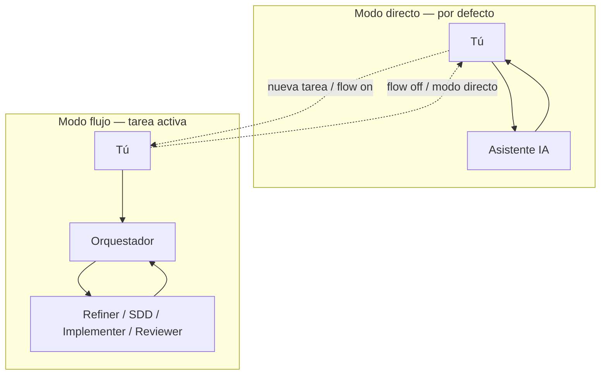

# Introducción

[← Índice](./README.md) · [English](../en/introduction.md)

---

## El problema

Los asistentes de IA son rápidos, pero el chat sin estructura suele traer:

- Requisitos vagos que pasan directo al código
- Scope creep y cambios sin revisión
- Pérdida de contexto entre “planifiquemos” y “aquí está el patch”

Terminas repitiendo las mismas reglas en cada sesión.

---

## Qué hace SpecFlow

SpecFlow es un CLI pequeño (`@ceatoleii/specflow`) que instala un **flujo estructurado** en tu repositorio. Sigue pareciendo chat — pero por detrás hay fases, specs en disco y **un solo agente** puede tocar el código fuente.

**Pipeline:** Requisito → Plan → Tareas → Código

| Fase | Quién | Tu papel |
|------|-------|----------|
| Refinar | Refiner | Responder preguntas; el `task.md` queda como contrato |
| Diseñar | SDD | Leer `plan.md` / `tasks.md`; decir **`/approve`** para permitir código |
| Implementar | Implementer | Seguir el progreso; desbloquear si pregunta |
| Revisar | Reviewer | Leer `review.md`; PASS archiva y apaga el flujo |

---

## Por qué usarlo

| Beneficio | Cómo |
|-----------|------|
| **Claridad antes del código** | Criterios **AC1**, **AC2**… en `task.md` antes de editar |
| **Puerta de diseño** | Sin implementación hasta `/approve` |
| **Un solo escritor** | Solo Implementer edita código fuente |
| **Rastro auditable** | Artefactos en `current/`; historial en `history/` |
| **Equipo alineado** | Mismas reglas en `.agents/`; `sync` actualiza el motor |

---

## Cuándo usarlo — y cuándo no

| Usa SpecFlow | Omítelo |
|--------------|---------|
| La feature tiene alcance y criterios claros | Fix de una línea |
| Quieres leer el plan antes del diff | Ya tienes spec firmada en otro sitio |
| Varios deben seguir las mismas reglas | Prefieres chat 100 % ad-hoc |

**Modo directo** (por defecto): sin `.agents-state/.flow-enabled` → cero overhead.

**Modo flujo**: inicias tarea → el orquestador enruta al agente de fase.

---

## Cómo encaja en tu proyecto

SpecFlow añade **carpetas de configuración y runtime** — no es un framework de app.

| Área | Quién la mantiene | Para qué |
|------|-------------------|----------|
| Tu código | Tú (Implementer en flujo) | Lo que entregas |
| `.agents-docs/` | **Tú** | Stack, estilo, tests de *tu* repo |
| `.agents/` | SpecFlow (`init` / `sync`) | Agentes y plantillas |
| `.agents-state/` | Runtime (gitignore) | Tarea activa |

El conocimiento del proyecto va en **`.agents-docs/`**. Las reglas del motor en **`.agents/`**, actualizadas con **`specflow sync`**.

---

## Qué no encontrarás aquí

Esta guía explica **cómo usar** SpecFlow en tu proyecto — no cómo se construye el paquete npm por dentro. Para el día a día no necesitas leer código del CLI ni docs de mantenedor.

---

[← Índice](./README.md) · [Primeros pasos →](./getting-started.md)
