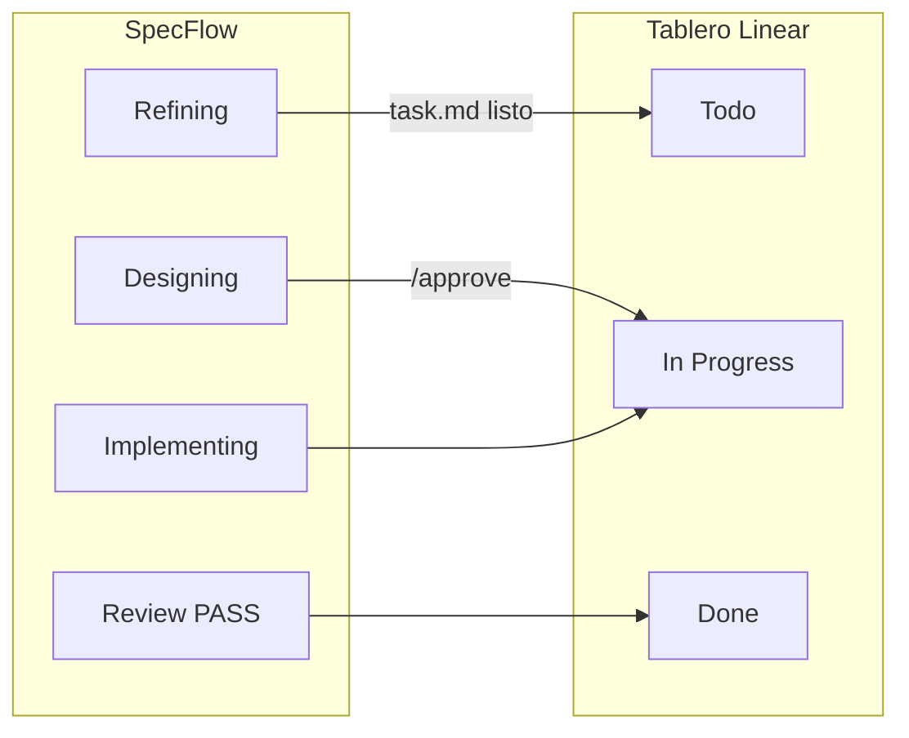

# Integración con Linear

[← Adaptadores IDE](./ide-adapters.md) · [English](../en/linear-integration.md)

---

## Qué es (y qué no es)

**SpecFlow no se conecta a Linear desde el CLI.** No hay API key en `init` ni en `specflow linear setup`.

| Capa | Rol |
|------|-----|
| **Cursor + plugin Linear** | Te autentica en Linear y expone MCP (`get_issue`, `save_issue`) |
| **SpecFlow en el repo** | Reglas + `.specflow-linear.json` indican al **agente en Cursor** cuándo usar esas herramientas |
| **Tu chat** | Iniciás con `nueva tarea desde TEAM-123` o una URL de Linear |

Si MCP no está disponible, el pipeline SpecFlow sigue en local — solo se omiten los cambios en el tablero.

---

## Checklist de requisitos

Primero en **Cursor** (una vez por máquina), después el **proyecto**:

### 1. Instalar Linear en Cursor

1. **Cursor Settings** → **Plugins** (o Extensions).
2. Buscar **Linear**, instalar/habilitar.
3. Iniciar sesión en tu workspace cuando lo pida.

### 2. Confirmar que MCP funciona

1. En Cursor, abrir ajustes de **MCP** / integraciones.
2. Verificar que el servidor **linear** aparece conectado.
3. El agente debe poder usar `get_issue` y `save_issue`.

> Hoy SpecFlow no puede verificar MCP desde la terminal. Si no sincroniza, arreglá Cursor ↔ Linear primero.

### 3. Configurar el proyecto

```bash
npx @ceatoleii/specflow init          # responder sí a Linear
# o en un repo ya instalado:
specflow linear setup
specflow linear setup --enable
specflow status                       # Linear: activado
```

Crea `.specflow-linear.json` con mapeo por defecto: **Todo** → **In Progress** → **Done**.

Personalizá nombres si tu equipo usa otros estados (`specflow linear setup` interactivo).

---

## Fases SpecFlow ↔ estados Linear



| Momento SpecFlow | Estado Linear por defecto |
|------------------|---------------------------|
| Refining terminado, esperando `/approve` | **Todo** |
| `/approve` → implementing | **In Progress** |
| Review **PASS** | **Done** |
| Review **FAIL** | Sigue **In Progress** |

La fase `reviewing` no mueve la tarjeta hasta el PASS → **Done**.

---

## Empezar desde un issue

En el **chat de Cursor**:

```text
nueva tarea desde ENG-42
```

o pegar la URL del issue.

El agente debería: `get_issue` → `linear.json` → `task.md` → flujo normal → actualizar estados en cada transición.

Sin id: `nueva tarea` (manual).

---

## Archivos

| Archivo | Uso |
|---------|-----|
| `.specflow-linear.json` | `enabled` + mapeo de estados |
| `.agents-state/current/linear.json` | Issue activo de la tarea |
| `.agents/rules/linear.md` | Instrucciones MCP (`sync`) |

---

## Desactivar

```bash
specflow linear setup --disable
```

---

## Problemas frecuentes

| Síntoma | Causa | Solución |
|---------|-------|----------|
| No actualiza Linear | MCP off en Cursor | Plugin + login + MCP |
| Aviso MCP no disponible | Plugin deshabilitado | Re-autenticar |
| Error de nombre de estado | Labels distintos en tu team | `specflow linear setup` |
| Flujo OK, tablero quieto | `enabled: false` | `--enable` |

Más: [Solución de problemas](./troubleshooting.md#linear-mcp).

---

[← Adaptadores IDE](./ide-adapters.md) · [Referencia CLI →](./cli-reference.md)
