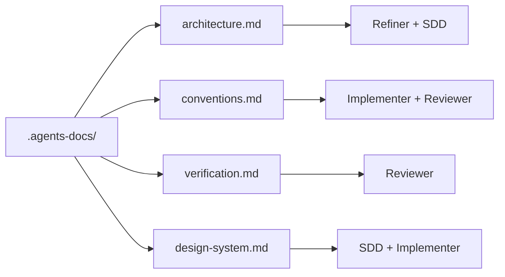

# Documentación del proyecto

[← Layout del proyecto](./project-layout.md) · [English](../en/project-documentation.md)

---

## Por qué existe `.agents-docs/`

SpecFlow trae reglas **genéricas** en `.agents/`. Tu repo es único: stack, carpetas, comandos de test, UI.

**`.agents-docs/`** enseña a los agentes *tu* proyecto para que:

- Hagan menos preguntas repetidas al refinar
- Diseñen planes acordes a tu arquitectura
- Implementen y revisen con **tus** comandos reales

Funciona sin esto, pero baja la calidad. Plantillas en `init` salvo `--no-docs`.

---

## Archivos y quién los lee

| Archivo | Fase | Responde |
|---------|------|----------|
| `architecture.md` | Refinar, Diseñar | ¿Qué es el proyecto y cómo está organizado? |
| `conventions.md` | Implementar, Revisar | ¿Cómo debe verse el código? |
| `verification.md` | Revisar | ¿Cómo demostramos que está bien? |
| `design-system.md` | Diseñar, Implementar | ¿Cómo debe verse la UI? (opcional) |



---

## Qué escribir en cada archivo

### `architecture.md`

- Tipo de proyecto (web, API, CLI, móvil…)
- Lenguaje, framework, runtime
- Estructura de carpetas que los agentes deben respetar
- Reglas de arquitectura en lenguaje de **uso**
- Servicios externos sin secretos ni credenciales

### `conventions.md`

- Nombres (archivos, funciones, componentes)
- Patrones preferidos y anti-patrones
- Estilo de imports y errores
- Convención de commits/PR si aplica

### `verification.md`

Comandos **en orden**:

```bash
npm ci
npm run lint
npm test
npm run build
```

Por cada uno: código de salida esperado y qué significa “pass”.

El **Reviewer** los ejecuta en revisión. Comandos viejos → FAIL falsos.

### `design-system.md` (opcional)

Tokens, componentes, accesibilidad. **Bórralo** si no hay UI.

---

## Cuándo completarlo

| Momento | Recomendación |
|---------|---------------|
| Tras `init` | Conservar plantillas; leer estructura |
| Antes del primer flujo real | Mínimo: `architecture.md` + `verification.md` |
| Proyecto con UI | Completar `design-system.md` |
| Cambio grande de stack | Actualizar en el mismo PR |

---

## Qué `sync` no toca

```bash
specflow sync
```

`.agents-docs/` sobrevive a actualizaciones del motor. Si mejoran plantillas upstream, fusiona ideas a mano.

---

## Consejos

1. **Sé específico** — mejor “TanStack Query para server state” que “buenas prácticas”
2. **Rutas reales** — `src/features/auth/` no “el módulo auth”
3. **Verificación al día** — comandos rotos bloquean en review
4. **Quita ruido** — sin `design-system.md` en backends puros
5. **Sin secretos** — nombres de variables de entorno, no API keys

---

## Nota de equipo

Commitea `.agents-docs/` como cualquier convención compartida. Mejorar `verification.md` mejora las revisiones de todos.

---

[← Layout del proyecto](./project-layout.md) · [Adaptadores IDE →](./ide-adapters.md)
