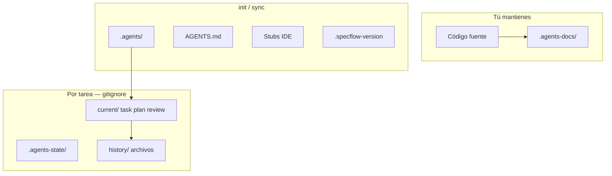

# Layout del proyecto

[← Referencia CLI](./cli-reference.md) · [English](../en/project-layout.md)

---

Tras `specflow init`, tu repo gana carpetas SpecFlow junto a tu código. Tres capas: **motor** (gestionado), **tus docs** (manual), **runtime** (gitignore).



---

## Árbol típico

```
tu-proyecto/
├── AGENTS.md
├── .specflow-version
├── .specflow-config.json
├── .specflow-linear.json     # mapeo opcional Linear
├── .specflow-tools.json
│
├── .agents/                  # Motor — orquestador + 4 agentes
│   ├── rules/
│   └── templates/
│
├── .agents-docs/             # Conocimiento de TU proyecto
│   ├── architecture.md
│   ├── conventions.md
│   ├── verification.md
│   └── design-system.md      # opcional
│
├── .agents-state/            # Runtime — en .gitignore
│   ├── .flow-enabled
│   ├── current/              # phase.md, task.md, linear.json, …
│   └── history/
│
└── .cursor/                  # Ejemplo con adaptador Cursor
    └── rules/_specflow.mdc
```

Más rutas según adaptador — [Adaptadores IDE](./ide-adapters.md).

---

## Qué abrir según necesidad

| Quiero… | Abrir |
|---------|-------|
| Ver fase activa | `phase.md` |
| Leer el contrato del requisito | `task.md` |
| Revisar diseño antes del código | `plan.md`, `tasks.md` |
| Seguir implementación | `tasks.md` + diff git |
| Ver resultado de revisión | `review.md` |
| Explicar el stack | `.agents-docs/architecture.md` |
| Explicar cómo probar | `.agents-docs/verification.md` |

---

## Gestionado vs tuyo

### SpecFlow gestiona

| Ruta | ¿`sync` lo actualiza? |
|------|:---------------------:|
| `AGENTS.md` | Sí |
| `.agents/**` | Sí |
| `.specflow-version` | Sí |
| `.specflow-tools.json` | Sí |
| Stubs de adaptadores | Sí |

No edites `.agents/rules/` a mano para “cambiar el producto” — usa `sync` tras actualizar el paquete.

### Tú eres dueño

| Ruta | Notas |
|------|-------|
| `.agents-docs/**` | `sync` no lo sobrescribe |
| Código fuente | Solo Implementer en flujo |
| `.gitignore` | Incluir `.agents-state/` |

### Solo runtime

| Ruta | Notas |
|------|-------|
| `.agents-state/**` | Borrable sin tarea activa |
| `current/*` | Se limpia en PASS |

---

## `.gitignore` recomendado

```gitignore
.agents-state/
```

Commitea motor SpecFlow y `.agents-docs/` para alinear al equipo.

---

## Flujo en equipo

| Acción | Quién | Hábito |
|--------|-------|--------|
| Primer clone | Cada dev | `init` o pull de archivos ya commiteados |
| Subir versión motor | Quien actualice | `sync` + commit `.specflow-version` |
| Tarea activa | Individual | `.agents-state/` solo local |
| Hechos del proyecto | Equipo | PRs a `.agents-docs/` |

---

[← Referencia CLI](./cli-reference.md) · [Documentación del proyecto →](./project-documentation.md)
