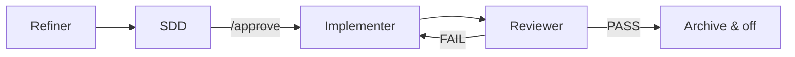

<div align="center">

# SpecFlow

**Spec-driven multi-agent workflow for Cursor and AI coding tools.**

Install once per project. Refine requirements, design the solution, implement with a single writer agent, and review against your spec — without losing project context between phases.

[](https://github.com/ceatoleii/specflow/actions/workflows/ci.yml)
[](https://www.npmjs.com/package/@ceatoleii/specflow)
[](https://opensource.org/licenses/MIT)
[](https://nodejs.org)
[](https://github.com/ceatoleii/specflow/actions/workflows/ci.yml)

[](https://www.typescriptlang.org/)
[](https://vitest.dev/)
[](https://cursor.com/)

[Installation](#installation) ·
[How it works](#how-it-works) ·
[CLI](#cli-reference) ·
[Project layout](#project-layout) ·
[Docs setup](#project-documentation) ·
[Contributing](#contributing)

```bash
npx @ceatoleii/specflow init
```

</div>

---

## Why SpecFlow?

AI coding assistants are fast, but unstructured sessions often lead to:

- Vague requirements carried straight into implementation
- Scope creep and unreviewed changes
- Lost context between “planning” and “coding” messages

**SpecFlow** enforces a lightweight pipeline: four specialized agents, one phase at a time, with files on disk as the source of truth. Only the **Implementer** can edit code; every other agent specifies, designs, or verifies.

Compatible with any tool that reads [`AGENTS.md`](https://agents.md/) — including **Cursor**, Claude Code, GitHub Copilot, and OpenAI Codex.

---

## How it works

### Two modes

| Mode | Trigger | Behavior |
|------|---------|----------|
| **Direct** | Default (no flag file) | Normal assistant behavior, zero overhead |
| **Flow** | `.agents-state/.flow-enabled` exists | Orchestrator routes to the active phase agent |

### Four agents, one pipeline



| Phase | Agent | Writes code? | Output |
|-------|--------|:------------:|--------|
| `refining` | Refiner | No | `task.md` — clarified requirement |
| `designing` | SDD | No | `sdd.md` + `tasks.md` (requires explicit approval) |
| `implementing` | Implementer | **Yes** | Code + task checklist |
| `reviewing` | Reviewer | No | `review.md` + verification run |

### Activation phrases

Say any of these in your AI chat (Spanish or English):

| Start flow | End flow |
|------------|----------|
| `nueva tarea` · `activar flujo` · `flow on` | `modo directo` · `flow off` · `desactivar flujo` |

Example: **`nueva tarea: add password reset to the login flow`**

---

## Installation

### New project

```bash
npx @ceatoleii/specflow init
```

### Global CLI (optional)

```bash
npm install -g @ceatoleii/specflow
specflow init
```

### What gets installed

| Path | Managed by | Purpose |
|------|--------------|---------|
| `.agents/` | `init` / `sync` | Agent rules and templates — **do not edit** |
| `AGENTS.md` | `init` / `sync` | Entry point for AI tools |
| `.cursor/rules/_specflow.mdc` | `init` / `sync` | Cursor orchestrator hook |
| `.agents-docs/` | **You** | Project-specific context (manual) |
| `.agents-state/` | Runtime | Per-task state (gitignored) |
| `.specflow-version` | `init` / `sync` | Installed package version |

Skip doc scaffolding if you prefer to add docs later:

```bash
npx @ceatoleii/specflow init --no-docs
```

---

## CLI reference

| Command | Description |
|---------|-------------|
| `specflow init` | Install or bootstrap SpecFlow in the current directory |
| `specflow sync` | Update engine files from the installed package |
| `specflow status` | Compare project version vs CLI version |

### Options

```bash
specflow init --no-docs       # skip .agents-docs/ scaffold
specflow init --dry-run       # preview files without writing
specflow sync --dry-run       # preview sync changes
specflow sync --yes           # allow sync while a flow task is active
specflow status -C ./my-app   # target another directory
```

### Versioning & sync safety

- **`sync` only updates the engine** — `.agents/`, `AGENTS.md`, and the Cursor rule.
- **`.agents-docs/` is never overwritten** by `sync`, even if templates change upstream.
- **`.specflow-version`** records what is installed; `status` tells you when to run `sync`.

```bash
npx @ceatoleii/specflow status   # → up to date | outdated | not installed
npx @ceatoleii/specflow sync     # after npm update @ceatoleii/specflow
```

---

## Project layout

After `init`, your repository root looks like this:

```
your-project/
├── AGENTS.md
├── .specflow-version
├── .agents/
│   ├── rules/          # orchestrator, refiner, sdd, implementer, reviewer
│   └── templates/      # sdd, tasks, review templates
├── .agents-docs/       # ← your project knowledge (manual)
│   ├── architecture.md
│   ├── conventions.md
│   ├── verification.md
│   └── design-system.md   # optional (front-end)
├── .agents-state/      # gitignored runtime state
│   ├── .flow-enabled
│   └── current/        # phase.md, task.md, sdd.md, …
└── .cursor/
    └── rules/
        └── _specflow.mdc
```

---

## Project documentation

`.agents-docs/` is the **only** directory meant to differ between projects. Fill it when you are ready — SpecFlow works without it, but agents have less context.

| File | Read by | Contents |
|------|---------|----------|
| `architecture.md` | Refiner, SDD | Stack, folder structure, architecture rules |
| `conventions.md` | Implementer, Reviewer | Naming, patterns, anti-patterns |
| `verification.md` | Reviewer | Test, lint, and build commands |
| `design-system.md` | SDD, Implementer | UI rules (optional; delete if N/A) |

Templates are created on `init` (unless `--no-docs`). Edit them to match your codebase.

---

## Design principles

1. **Spec before code** — No implementation until the SDD is approved (`/approve`).
2. **Single writer** — Only the Implementer agent may change source files.
3. **Explicit state** — Phase and artifacts live in `.agents-state/current/`.
4. **Portable rules** — Agent logic ships with the package; project facts live in `.agents-docs/`.
5. **Safe upgrades** — `sync` refreshes the engine without touching your documentation.

---

## Contributing

This package lives in the [ceatoleii/specflow](https://github.com/ceatoleii/specflow) repository.

```bash
git clone https://github.com/ceatoleii/specflow.git
cd specflow
npm install
npm run build -w @ceatoleii/specflow
npm run test:coverage -w @ceatoleii/specflow
```

Pull requests welcome. Please keep tests passing and coverage at or above **80%**.

See [CHANGELOG.md](./CHANGELOG.md) for release notes.

### Publishing (GitHub Actions)

Releases are published automatically via [`.github/workflows/publish.yml`](../../.github/workflows/publish.yml). No OTP in CI — uses an npm automation token.

**One-time setup**

1. [npmjs.com → Access Tokens](https://www.npmjs.com/settings/tokens) → **Granular Access Token**
2. Permissions: **Read and write** on `@ceatoleii` (or this package)
3. Enable **Bypass two-factor authentication for automation** (required for CI)
4. GitHub repo → **Settings → Secrets and variables → Actions** → New secret: `NPM_TOKEN`

**Release flow**

1. Bump version in `packages/specflow/package.json` and update `CHANGELOG.md`
2. Commit, push, create GitHub Release with tag `vX.Y.Z` (must match `package.json`)
3. The publish workflow runs tests and runs `npm publish`

**Manual publish** (emergency): Actions → **Publish npm** → **Run workflow**

---

## License

[MIT](./LICENSE) © [ceatoleii](https://github.com/ceatoleii)
