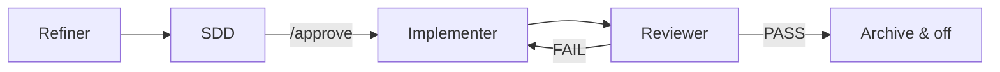

# How It Works

[← Getting Started](./getting-started.md) · [Español](../es/how-it-works.md)

---

## Two modes

| Mode | Trigger | Behavior |
|------|---------|----------|
| **Direct** | Default (no flag file) | Normal assistant behavior, zero overhead |
| **Flow** | `.agents-state/.flow-enabled` exists | Orchestrator routes to the active phase agent |

Direct mode is the default. SpecFlow rules are loaded by your IDE adapter, but the orchestrator only enforces the pipeline when flow is active.

---

## Four agents, one pipeline



| Phase | Agent | Writes code? | Output |
|-------|--------|:------------:|--------|
| `refining` | Refiner | No | `task.md` — clarified requirement |
| `designing` | SDD | No | `sdd.md` + `tasks.md` (requires explicit approval) |
| `implementing` | Implementer | **Yes** | Code + task checklist |
| `reviewing` | Reviewer | No | `review.md` + verification run |

### Refiner

Clarifies the requirement. Asks focused questions. Produces `task.md` with acceptance criteria, constraints, and affected areas. Never writes code.

### SDD (Solution Design Document)

Designs the technical solution from `task.md`. Produces `sdd.md` and an ordered `tasks.md`. Waits for explicit **`/approve`** before any code is written.

### Implementer

The **only** agent allowed to create, edit, or delete source files. Executes `tasks.md` in order. Stops on spec gaps or blockers instead of guessing.

### Reviewer

Verifies implementation against the SDD and acceptance criteria. Runs the project's verification commands. On PASS, archives the session and deactivates flow. On FAIL, returns work to Implementer.

---

## Activation phrases

Say any of these in your AI chat (Spanish or English):

| Start flow | End flow |
|------------|----------|
| `nueva tarea` · `activar flujo` · `flow on` · `new task` | `modo directo` · `flow off` · `desactivar flujo` · `direct mode` |

### Examples

```
nueva tarea: add password reset to the login flow
```

```
flow on — fix the pagination bug on the users list
```

Ending flow removes `.agents-state/.flow-enabled`. Active task artifacts may remain in `.agents-state/current/` until archived.

---

## State on disk

During an active task, artifacts live in `.agents-state/current/`:

| File | Phase | Purpose |
|------|-------|---------|
| `phase.md` | all | Current phase shim (`refining`, `designing`, …) |
| `task.md` | refining+ | Clarified requirement |
| `sdd.md` | designing+ | Technical specification |
| `tasks.md` | implementing+ | Ordered implementation checklist |
| `review.md` | reviewing | Review result |
| `refinement-log.md` | refining | Q&A history (compacted after task.md) |

With **Context Engine 1.3+**, agents prefer `specflow state query` slices when `state.db` exists. See [Context Engine](./context-engine.md).

---

## Approval gate

No implementation starts until you explicitly approve the design:

```
/approve
```

Also accepted: `aprobado`, `dale`, or clear approval language. The SDD agent will not advance on vague agreement.

---

[← Getting Started](./getting-started.md) · [CLI Reference →](./cli-reference.md)
