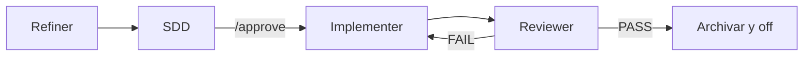

# Cómo funciona

[← Primeros pasos](./getting-started.md) · [English](../en/how-it-works.md)

---

## Dos modos

| Modo | Disparador | Comportamiento |
|------|------------|----------------|
| **Direct** | Por defecto (sin archivo flag) | Asistente normal, cero overhead |
| **Flow** | Existe `.agents-state/.flow-enabled` | Orquestador enruta al agente de fase activa |

Direct es el modo por defecto. Las reglas SpecFlow las carga tu adaptador IDE, pero el orquestador solo impone el pipeline con el flujo activo.

---

## Cuatro agentes, un pipeline



| Fase | Agente | ¿Escribe código? | Salida |
|------|--------|:----------------:|--------|
| `refining` | Refiner | No | `task.md` — requisito clarificado |
| `designing` | SDD | No | `sdd.md` + `tasks.md` (requiere aprobación explícita) |
| `implementing` | Implementer | **Sí** | Código + checklist de tareas |
| `reviewing` | Reviewer | No | `review.md` + verificación |

### Refiner

Clarifica el requisito. Hace preguntas concretas. Produce `task.md` con criterios de aceptación, restricciones y áreas afectadas. Nunca escribe código.

### SDD (Solution Design Document)

Diseña la solución técnica desde `task.md`. Produce `sdd.md` y `tasks.md` ordenado. Espera **`/approve`** explícito antes de escribir código.

### Implementer

El **único** agente autorizado a crear, editar o borrar archivos fuente. Ejecuta `tasks.md` en orden. Se detiene ante huecos en la spec o bloqueos en lugar de improvisar.

### Reviewer

Verifica la implementación contra el SDD y criterios de aceptación. Ejecuta comandos de verificación del proyecto. Con PASS archiva la sesión y desactiva el flujo. Con FAIL devuelve trabajo al Implementer.

---

## Frases de activación

Di cualquiera de estas en tu chat de IA (español o inglés):

| Iniciar flujo | Terminar flujo |
|---------------|----------------|
| `nueva tarea` · `activar flujo` · `flow on` · `new task` | `modo directo` · `flow off` · `desactivar flujo` · `direct mode` |

### Ejemplos

```
nueva tarea: añadir reset de contraseña al login
```

```
flow on — arreglar el bug de paginación en la lista de usuarios
```

Terminar el flujo elimina `.agents-state/.flow-enabled`. Los artefactos pueden quedar en `.agents-state/current/` hasta archivarse.

---

## Estado en disco

Durante una tarea activa, los artefactos viven en `.agents-state/current/`:

| Archivo | Fase | Propósito |
|---------|------|-----------|
| `phase.md` | todas | Shim de fase actual |
| `task.md` | refining+ | Requisito clarificado |
| `sdd.md` | designing+ | Especificación técnica |
| `tasks.md` | implementing+ | Checklist de implementación |
| `review.md` | reviewing | Resultado de revisión |
| `refinement-log.md` | refining | Historial Q&A (compactado tras task.md) |

Con **Context Engine 1.3+**, los agentes prefieren slices de `specflow state query` cuando existe `state.db`. Ver [Context Engine](./context-engine.md).

---

## Puerta de aprobación

No hay implementación hasta aprobar el diseño explícitamente:

```
/approve
```

También vale: `aprobado`, `dale`, o aprobación clara. El agente SDD no avanza con acuerdo vago.

---

[← Primeros pasos](./getting-started.md) · [Referencia CLI →](./cli-reference.md)
